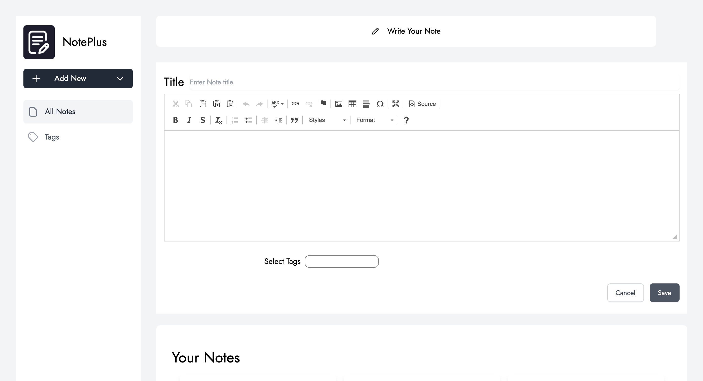
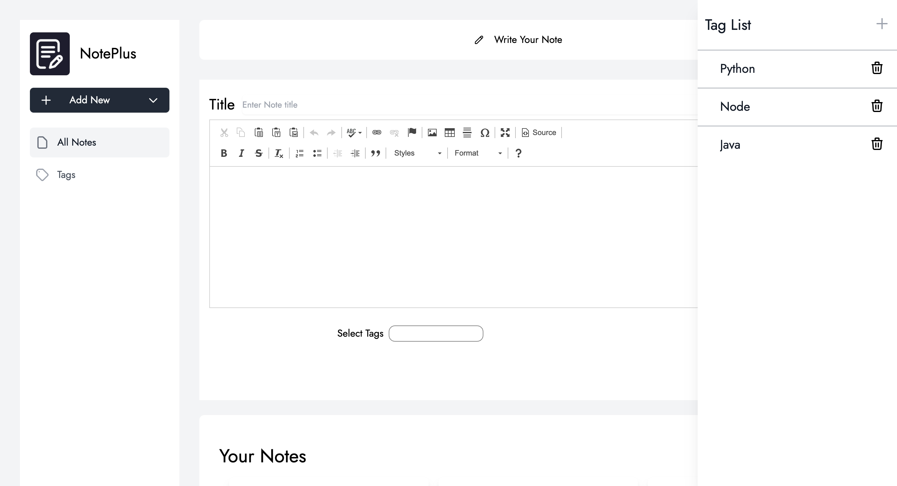

# NotePlus

Manage all your notes and filter them by Tags


## Features

- NextJS
- Redux 
- Typescript
- Tailwind CSS


  
## Run Locally

Clone the project

```bash
  git clone https://github.com/webdevsamurai/NotePlus-Frontend
```

Go to the project directory

```bash
  cd NotePlus-Frontend
```

Install dependencies

```bash
  npm i
```

Start the server

```bash
  npm run dev
```

  
## Screenshots

##   Homepage


##   Create Note


##   Tags


##   Edit Note


